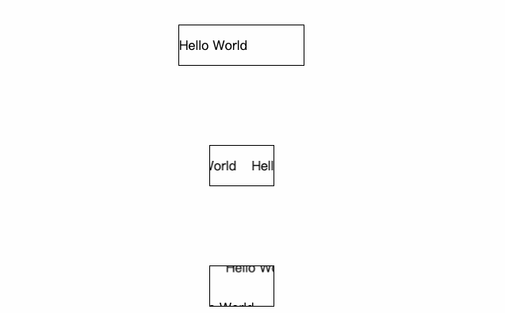

# vue-rolling-marquee


[![blog](https://img.shields.io/badge/blog-yesifang.com-orange?logo=data:image/png;base64,iVBORw0KGgoAAAANSUhEUgAAACAAAAAgCAMAAABEpIrGAAAABGdBTUEAALGPC/xhBQAAACBjSFJNAAB6JgAAgIQAAPoAAACA6AAAdTAAAOpgAAA6mAAAF3CculE8AAABjFBMVEUAAAAIAQUiBhQVBA05CyK0I2z4MJTgKoV8GEoKAgZyFkT8MZfTKX4dBRFWEDP9MZfMJ3kGAQQHAQTlK4htFUEAHRMATDAAbUQAf1EAh1QAgFAAbUUATDAAHhNMDy7KJngAeUsAKBp9GEr4MJMDAQIAmWEAWzkABAOGGlD9MZYAcUgABQNoFD7mLIoAZUCdHl4ANiKiH2EpCBgAh1UAAgERAwrVKH9nFD0ALBwSAwuqIWXmK4pTEDIAWTgrCBp2F0eVHVmKG1NWETMAdEgAgVAAAQIAJTcATXIAZJQAbqUAap0AVoEAfE4AAQEAN1EAgMAAaEIACQ4Aap4ARiwACQ0AebMAmV8AEwwAAAAAZ5oAZT8AMkkAkFoAEQsAebMAl14AGCQAkl0ALx4AOlYAeEsAGRAATHAAbkUAll0All4AbkYAMB4ATXMABwQAIxYANiIAPicANyIAJBYAQF4AIjIAis0AAgMAhsYAZJYARWYAk9oAHy4ABQcAfbkAO1gAis3/MZgAmmEAld3///8EabibAAAAgHRSTlMACCIVObX54XwKcv3UHVb+zQYH5m0xfrTU4NW1fzJMy8hDffkD/pcHh/69CGjnqJ5ZoynfBBHWZ0kSqudTlCt2lotWwNUCQIOrvrWVzwFe3a4QtnQPz/0gAbKnVe4c0Psp9E9jximBtvj4t0+FCzpaZlo7bTruA+Wtdfs1CNdm7ZpKyEIAAAABYktHRIP8tM/SAAAAB3RJTUUH5QoVBh0NInrzjgAAATtJREFUOMt902VbwzAUBeDLcAYMhru7uzPcXYcP1+EyPMkvZ03TNk0TztfzNnL7BECeCFck/JOo6BiEYuPiVX2CG9EkJsn7ZA9iSUmV9d40ZCYdICMzKzsnNy+/wASFVo+KALCR4hIGSjlQVm4BXFFZRUE1B2q8HMC4tk4D9RxoABvAjRpwuS3QJADcrIkW6witImhrD4OOTtZ7ukAEuFtboqeXjqqvH5xgQL/qoG9oeET/FQIYdQxWAGNmMT4xOTU9MyuCOVbPLywSGhEs6f3yCiFysEr7tXWiABubWu/fIiqwTRfYISqwu0fBvgoc0DlCgCjA4ZF+hWMFODllMzizgfML2l5eXfuNGd7YAARv7+4fHoPc9J/swJlnrn+Rgdc3C4SkT+vd7D8+peDr2+h/FK838Ev3D4W//wNiKCWwWalJAwAAACV0RVh0ZGF0ZTpjcmVhdGUAMjAyMS0xMC0yMVQwNjoyOToxMyswMDowMP1Zb/cAAAAldEVYdGRhdGU6bW9kaWZ5ADIwMjEtMTAtMjFUMDY6Mjk6MTMrMDA6MDCMBNdLAAAAAElFTkSuQmCC)](//yesifang.com)

> 这是一个 Vue 组件，提供一个自动滚动的字幕(跑马灯)。
>
> This is a Vue component that provides an auto-scrolling marquee.

<div align="center">
  <a href="https://nodei.co/npm/vue-rolling-marquee/"></a>
</div>

## Run Simple Demo



```shell
$ git clone https://github.com/SuperYesifang/vue-rolling-marquee.git
$ cd vue-rolling-marquee
$ npm install
$ npm run dev
```

## Usage

### 1. Global Use in Vue-Cli Project

-   main.js

```js
import Vue from "vue";
import VueRollingMarquee from "vue-rolling-marquee";

Vue.use(VueRollingMarquee);

new Vue({
  el: "#app",
  render: h => h(App)
});
```

-   App.vue

```vue
<template>
  <div id="app">
    <vue-rolling-marquee class="vue-rolling-marquee">Some contents that need to be rolling ...</vue-rolling-marquee>
  </div>
</template>

<style>
  /* Height must be set for vue-rolling-marquee */
  .vue-rolling-marquee {
    height: 400px;
  }
</style>
omit...
```

### 2. Direct Use in Vue-Cli Project

-   App.vue

```vue
<template>
  <div id="app">
    <rolling-marquee>Some contents that need to be rolling ...</rolling-marquee>
  </div>
</template>

<script>
  import RollingMarquee from "vue-rolling-marquee";

  export default {
    name: "App",
      components: {
      RollingMarquee
    }
    omit...
  };
</script>

<style>
  /* Height must be set for vue-rolling-marquee */
  .vue-rolling-marquee {
    height: 400px;
  }
</style>
```

## Options

Some Vue prop options to config ScrollingUl.

| prop      | description                                                                                                | type    | default  |
| --------- | ---------------------------------------------------------------------------------------------------------- | ------- | -------- |
| direction | Direction of rolling. (accept: `"top”`,`”right”`,`”bottom”`,`”left”` or CSS3 rotate angle,example `30deg`) | String  | `"left"` |
| speed     | Speed of rolling. (unit: `pixel/s`, remark: Must be a positive number)                                     | Number  | `30`     |
| duration  | The time of a full rolling.                                                                                | Number  |          |
| shadow    | Turn on shadow shuttle effect. 																			 | Boolean | `true`   |
| prompt    | Turn on teleprompter mode.                                    											 | Boolean | `false`  |
| promptGap | The width of the gap between the shuttle part and the unshuttle part of the content block. (unit: `pixel`) | Number  | `20`     |

## Detailed Options

Describe Prop Options in detail

### direction

This prop option is used to configure marquee rolling direction.

-   Support accept some keywords: `"left"`，`"right"`, `"bottom"`, `"left"`.
-   Support setting angle is simiar to CSS3 transform rotate, example: `"45deg"`, `"-128deg"`.

> Table of the meaning of keywords:

| keyword    | description       | equivalent angle |
| ---------- | ----------------- | ---------------- |
| `"top"`    | rolling to top    | `"0deg"`         |
| `"right"`  | rolling to right  | `"90deg"`        |
| `"bottom"` | rolling to bottom | `"180deg"`       |
| `"left"`   | rolling to left   | `"270deg"`       |

### speed & duration

Both prop options are used to control the speed of scrolling. **speed** is prior than **duration**.

-   speed: Setting the speed of rolling. (unit：`pixel/s`, default: `30`)
-   duration: Setting the time it takes to rolling once. (unit: `ms`)

### shadow

Turn on shadow shuttle effect. When the content block is out of the display area, shuttle into it from the opposite side.

### prompt

Turn on teleprompter mode. When the content block does not exceed the display area, it appears as normal content. When the display area is exceeded,will be as  rolling marquee, similar to a teleprompter.
> The teleprompter mode only supports rolling in horizontal and vertical directions.

### promptGap

When teleprompter mode turnd on. The width of the gap between the shuttle part and the unshuttle part of the content block. (unit: `pixel`)